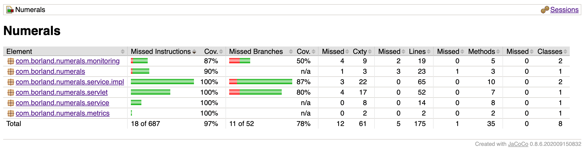
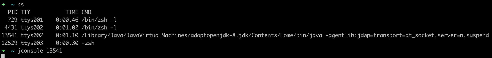
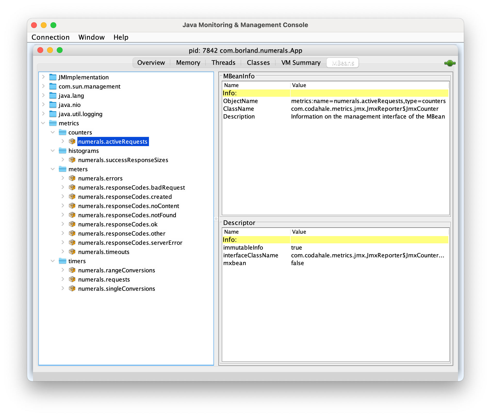

# Roman Numerals

## Overview

Roman Numerals is a simple Java web application, running on an embedded Jetty server, which hosts a servlet for converting single numbers & ranges of numbers (between 1-3999) to their Roman Numeral representations following the [Standard Form](https://en.wikipedia.org/wiki/Roman_numerals#2Standard_form).

## Prequisites
Buiding & running Roman Numerals requires the following to be installed:
- [Java 1.8](https://docs.oracle.com/javase/8/)
- [Maven 3](https://maven.apache.org/)

## Usage
Upon [building](#building) & [deploying](#deploying) the code, the application will be available at http://localhost:8080/romannumeral.

The application has two different modes: 

#### Single Mode
Single mode takes in a single integer query string parameter (<code>query</code>) between 1 and 3999, converts it to a Roman Numeral, and returns the value as a JSON object.

*Example:*

Request:

<code>GET http://localhost:8080/romannumeral?query=2784</code>

Response:

```json
{
   "number":2784,
   "numeral":"MMDCCLXXXIV"
}
```

#### Range Mode
Range mode takes in two integer query string parameters (<code>min</code> and <code>max</code>, where <code>min < max</code>) between 1 and 3999, converts (multithreaded) all of the numbers in that range to Roman Numerals, and returns the values as an array of JSON objects.

*Example:*

Request:

<code>GET http://localhost:8080/romannumeral?min=134&max=141</code>

Response:
```json
[
   {
      "number":134,
      "numeral":"CXXXIV"
   },
   {
      "number":135,
      "numeral":"CXXXV"
   },
   {
      "number":136,
      "numeral":"CXXXVI"
   },
   {
      "number":137,
      "numeral":"CXXXVII"
   },
   {
      "number":138,
      "numeral":"CXXXVIII"
   },
   {
      "number":139,
      "numeral":"CXXXIX"
   },
   {
      "number":140,
      "numeral":"CXL"
   },
   {
      "number":141,
      "numeral":"CXLI"
   }
]
```

#### Error Handling
Errors will be handled with the appropriate response status (i.e. <code>400</code> for bad requests, <code>405</code> for unsupported methods, <code>500</code> for internal errors).

## Strategy

### Conversion Process

In order to convert numbers to Roman Numerals, we must first establish a map of known symbols to known values.  This map includes all base numerals as well as any subtractive notation anomalies (as they cannot be derived using the additive notation, which our process is based on).

**Additive notation:**  Numerals are added together to get a final numeral, starting with the largest symbols first (i.e. 7 is represented by VII).

**Subtractive notation:**  Numerals are subtracted to get a final numeral.  In this notation, the smaller numeral is first (i.e. 4 is represented by IV).

**Numeral Map**
| Number | Numeral | Note |
| --- | --- | --- |
| <code>1</code> | <code>I</code> | |
| <code>4</code> | <code>IV</code> | Subtractive Anomaly |
| <code>5</code> | <code>V</code> | |
| <code>9</code> | <code>IX</code> | Subtractive Anomaly |
| <code>10</code> | <code>X</code> | |
| <code>40</code> | <code>XL</code> | Subtractive Anomaly |
| <code>50</code> | <code>L</code> | |
| <code>90</code> | <code>XC</code> | Subtractive Anomaly |
| <code>100</code> | <code>C</code> | |
| <code>400</code> | <code>CD</code> | Subtractive Anomaly |
| <code>500</code> | <code>D</code> | |
| <code>900</code> | <code>CM</code> | Subtractive Anomaly |
| <code>1000</code> | <code>M</code> | |

Once the map has been established, converting numbers to numerals is a straightforward recursive process:

1. Find the largest mapped numeral that fits into your number.  
2. Append numeral from (1) to your combined numeral string.
3. Subtract the value of numeral found in (1) from your number in (1).
4. If the result of (3) is 0, stop.  If not, start back at (1) using the result of (3).

*Example 1: Converting 476*

1. Largest number to fit into 476 is 400 (<code>CD</code>).
2. Combined string: <code>"CD"</code>.
3. Subtract numeral value.  Remaining number: 76
4. Largest number to fit in 76 is 50 (<code>L</code>).
5. Combined string: <code>"CDL"</code>.
6. Subtract numeral value.  Remaining number: 26
7. Largest number to fit in 26 is 10 (<code>X</code>).
8. Combined string: <code>"CDLX"</code>.
9. Subtract numeral value.  Remaining number: 16
10. Largest number to fit into 16 is 10 (<code>X</code>).
11. Combined string: <code>"CDLXX"</code>.
12. Subtract numeral value.  Remaining number: 6
13. Largest number to fit into 6 is 5 (<code>V</code>).
14. Combined string: <code>"CDLXXV"</code>.
15. Subtract numeral value.  Remaining number: 1
16. Largest number to fit into 1 is 1 (<code>I</code>).
17. Combined string: <code>"CDLXXVI"</code>.
18. Subtract numeral value. Remaining number: 0
19. Stop. Final numeral is <code>"CDLXXVI"</code>.

*NOTE: Following this process, you can see why 400 needs a mapped anomaly.  If the anomaly was not mapped, the value would have returned <code>CCCCLXXVI</code>, which is incorrect.*

## Development

### Project Structure

Numerals has a simple project structure with a single Maven project/module.  Project code is broken out using the standard separation between `main` and `test ` source code.

    .
    ├── pom.xml
    └── src
        ├── main
        │   └── java
        │       └── com
        │           └── borland
        │               └── numerals
        │                   ├── App.java
        │                   ├── monitoring
        │                   │   ├── HealthCheckContextListener.java
        │                   │   └── NumeralsHealthCheck.java
        │                   ├── service
        │                   │   ├── NumeralPair.java
        │                   │   ├── NumeralService.java
        │                   │   └── impl
        │                   │       ├── StandardFormNumeralCallable.java
        │                   │       └── StandardFormNumeralServiceImpl.java
        │                   └── servlet
        │                       └── NumeralServlet.java
        └── test
            └── java
                └── com
                    └── borland
                        └── numerals
                            └── service
                                └── NumeralServiceTest.java


### Design

**Embedded Server**

Numerals uses an embedded Jetty server to host & deliver servlet functionality.  This server as well as the foundations for logging, metrics & monitoring are established in <code>App</code>.

**Numeral Service & Numeral Pairs**

<code>NumeralService</code> introduces an interface for converting numbers to numerals and returning results as <code>NumeralPair</code> object(s).  This provides a common interface to allow for implementations for each of the numeral form variations.

**Standard Form Numeral Service**

<code>StandardFormNumeralServiceImpl</code> provides a <code>NumeralService</code> implementation class that converts numbers to Roman Numerals using the Standard Form.  Orchestration is performed in the service implementation class, but the actual conversion occurs in <code>StandardFormNumeralCallable</code>.  By separating the logic into a callable class, we are able to use concurrent threads (10 by default) to convert large ranges of numbers.

**Numeral Servlet**

<code>NumeralServlet</code> provides ability for interaction with our application.  It surfaces an endpoint that takes in parameters, validates these parameters, calls the appropriate service functionality & returns the result as JSON.

**Health Check**

<code>NumeralsHealthCheck</code> provides a health check which probes the <code>NumeralServlet</code> checking for 200 status code.  This health check is registered in the <code>HealthCheckContextLister</code>, which is in turned registered as a <code>ServletContextListener</code> in <code>App</code>.

**Metrics**

<code>MetricsInstrumetedFilterContextListener</code> provides our <code>MetricsRegistry</code> instance to the <code>InstrumentedFilterContextListener</code> which is registered as a <code>ServletContextListener</code> along with an <code>InstrumentedFilter</code> in <code>App</code> . This filter provides all of the request & response [metrics](#Metrics) documented below.

Additional metrics are captured inline in <code>NumeralServlet</code> & <code>StandardFormNumeralServiceImpl</code>.

**Unit Tests**

All of the unit tests reside in the project under the <code>/src/test</code>.  See the [code coverage](#Code-Coverage) section for the latest coverage statistics.


### Building

The project can be built into a single executable JAR (via <code>maven-assembly-plugin</code>) using the following command:

<code>mvn clean install</code>

### Deploying

Upon successfully building the project, an executable JAR (<code>numerals-1.0-SNAPSHOT-jar-with-dependencies.jar</code>) will be available in your project's <code>target</code> folder.

Start the application with the following command:

<code>java -jar numerals-1.0-SNAPSHOT-jar-with-dependencies.jar</code>


### Testing
Unit testing is performed using [JUnit 4](https://junit.org/junit4/) & [Mockito](https://site.mockito.org/) and is integrated into the build process.  Unit tests can be explicitly run using the following command:

<code>mvn clean test</code>

### Code Coverage
Code coverage is calculated using [JaCoCo](https://www.eclemma.org/jacoco/).  A code coverage report can be generated using the following command:

<code>mvn clean verify</code>

The code coverage report can be found at <code>/target/site/jacoco/index.html</code> after successfully running the tool.

**Current Code Coverage Statistics**



## Dev Ops

### Logging
Logging is achieved using a basic console appender from [Log4j](https://logging.apache.org/log4j) (with a default log level of <code>DEBUG</code>), which is setup in `App`.  Additional appenders could be added programmatically or read in via configuration.

[SLF4J](http://www.slf4j.org/) is used to obfuscate the logging calls from the underlying logging framework (Log4j) to allow logging frameworks to be swapped in & out 

*NOTE: SLF4J Maven dependency would need to be changed to appropriate framework.*

### Metrics
Metrics are captured via [Metrics](https://metrics.dropwizard.io/) and surfaced to JMX.  These metrics can be easily viewed using [JConsole](https://docs.oracle.com/javase/8/docs/technotes/guides/management/jconsole.html) under "metrics".



*NOTE: You must make a request to the numeral endpoint before some metrics will appear.*

The following metrics are captured by the application:

- Counters
  - **numerals.activeRequests* - Number of active requests
- Histogram
  - *numerals.successResponseSizes* - Number & size of succesful responses.
- Meters
  - **numerals.errors* - The rate of unhandled errors.
  - **numerals.responseCodes.badRequests* - Rate of bad request (<code>400</code>) responses returned.
  - **numerals.responseCodes.created* - Rate of created (<code>201</code>) responses returned.
  - **numerals.responseCodes.noContent* - Rate of no content (<code>204</code>) responses returned.
  - **numerals.responseCodes.notFound* - Rate of not found (<code>404</code>) responses returned.
  - **numerals.responseCodes.ok* - Rate of ok (<code>200</code>) responses returned.
  - **numerals.responseCodes.other* - Rate of other reponses not specifically captured.
  - **numerals.responseCodes.serverError* - Rate of server error (<code>500</code>) responses returned.
  - **numerals.timeouts* - Rate of timed out requests.
- Timers
  - *numerals.rangeConversions* - Time to perform & frequency of range conversions.
  - **numerals.requests* - Time to handle request & request frequency.
  - *numerals.singleConversions* - Time to perform & frequency of single conversions.

Metrics are captured both inline programmatically and via an <code>[InstrumentedFilter](https://www.javadoc.io/doc/io.dropwizard.metrics/metrics-servlet/4.1.17/com/codahale/metrics/servlet/InstrumentedFilter.html)</code> with the latter being denoted above (*).



### Monitoring
The system status can be monitored via a Health Check endpoint (`/healthcheck`) provided by [Metrics](https://metrics.dropwizard.io/), which returns a status for all available health checks in the system.

Available Health Checks:
- **Numerals Health Check** - Pings the numerals servlet to confirm a 200 status.

*Example:*

Request:

<code>GET http://localhost:8080/healthcheck</code>

Response:

```json
{
   "numerals-servlet":{
      "healthy":true,
      "duration":314,
      "timestamp":"2021-01-26T13:53:37.430-05:00"
   }
}
```


## Dependencies / Resources
The following resources were used and/or consulted in the creation of this application.

- [Maven 3](https://maven.apache.org/)
- [Java 1.8](https://docs.oracle.com/javase/8/)
- [Jetty 9.4](https://www.eclipse.org/jetty/)
- [Metrics](https://metrics.dropwizard.io/)
- [Jackson](https://github.com/FasterXML/jackson)
- [Apache HttpComponents](https://hc.apache.org/)
- [SLF4J](http://www.slf4j.org/)
- [Log4j](https://logging.apache.org/log4j)
- [JUnit 4](https://junit.org/junit4/)
- [Mockito](https://site.mockito.org/)
- [JaCoCo](https://www.eclemma.org/jacoco/)
- [Wikipedia](https://en.wikipedia.org/wiki/Roman_numerals)